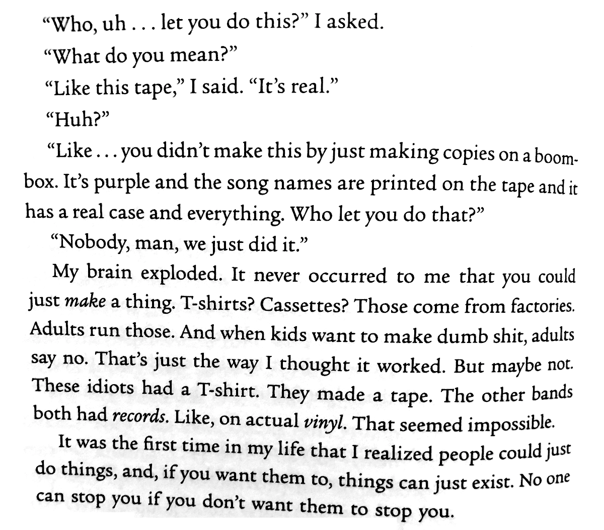

Hace poco leí el libro [Lose Well](https://chrisgeth.com/lose-well/), de Chris Gethard, una de mis personas favoritas en el mundo. Y digo persona en lugar de comediante porque no es necesariamente ese rol el que me hace ser tan fan, sino la manera que tiene de hacer cosas de formas poco convencionales. Su show en Public Access TV, The Chris Gethard Show es la muestra principal de eso, pero también está su podcast, Beautiful Anonymous, o su show de stand-up mezclado con Ted Talk, Career Suicide.

El libro está entretenido, ligero, con tintes de libro de autoayuda, pero esta parte, del capítulo titulado "Punk", donde Chris adolescente habla con otro adolescente en un toquín punk después de comprarle un cassette de su banda fue mi favorita:

Mi traducción muy liberal:

> "¿Quién te dejó hacer esto?" Pregunté 
> "¿Qué quieres decir?" 
> "Este cassette", dije. "Es real" 
> "¿Eh?" 
> "O sea... no lo hiciste haciendo copias en una grabadora. Es morado y tiene impresos los nombres de las canciones, tiene una caja de verdad y todo. ¿Quién te dejo hacerlo?" 
> "Nadie... nada más lo hicimos" 
> Mi cabeza explotó. Nunca se me había ocurrido que simplemente puedes hacer algo. ¿Camisetas? ¿Cassettes? Esas cosas se hacen en fábricas, y los adultos manejan las fábricas. Y cuando los niños quieren hacer cosas tontas los adultos dicen no. Pensé que así funcionaba, pero quizás no. Estos idiotas tenían camisetas. Hicieron un cassette. Las otras bandas tenían discos en vinyl. Parecía imposible. 
> Fue la primera vez en mi vida que me di cuenta de que la gente puede simplemente hacer cosas. Si quieres, las cosas pueden simplemente existir. Nadie te puede detener si tu no quieres que te detengan.

Me recordó a la primera vez que tuve un sitio web. No fue en Geocities o Tripod o uno de esos hosts. Mi mejor amigo de la prepa contrató internet en su casa, y le daban espacio en el servidor del ISP para publicar un sitio web. En cuanto nos enteramos, pasamos un par de días viendo el código de otros sitios web y copiando y aprendiendo lo que podíamos, hasta que tuvimos un website lleno de babosadas, pero gloriosamente nuestro. Era 1997, creo.

Estaba muy emocionado, y esa semana, comiendo en casa de una tía, les conté a todos que tenía un sitio web y les di la "dirección". No recuerdo que dijeron los demás, pero sí la reacción de mi tía. Tenía muchas preguntas.

>"¿Pero qué publicas ahi?" 
"Lo que sea. Chistes, fotos escaneadas, dibujos" 
 
"¿Pero hay un proceso para poner eso en internet?" 
"Nada más lo escribimos de cierta manera para que sea una página web, y lo copiamos a un servidor, una computadora que siempre está conectada a internet" 
 
"¿Pero... dónde solicitaste permiso? ¿Quien autoriza eso?" 
"Nadie, nada más lo hicimos" 
 
"¿O sea que puedes poner lo que quieras y nadie lo revisa?" 
"Ajá"

Recuerdo que después de ese intercambio mi tía seguía muy incrédula. No se si por las posibilidades del medio o por la idea de que un chamaco suato tuviera el poder de publicar lo que quisiera ante el mundo.

La cosa es que esa pequeña partecita del libro de Chris Gethard me hizo apreciar esto que tenemos. En los 70s, las herramientas de los activistas sociales eran las prensas clandestinas y las radios piratas. Ahora todos tenemos la posibilidad de tener los equivalentes a eso, con mucho más facilidad, a menor costo (o gratis), y de manera legal. Este sitio es una de esas cosas. Las redes sociales, los podcasts, YouTube, todos nos permiten poner nuestras voz y nuestras ideas en el mundo sin pedirle permiso a los "adultos".

Los invito a ser punks y compartir su voz. Está bien chilo. Y los dejo con una lista de gente punk de mi alrededor que hace cosas porque sí.

- [Cazacheves, Kalolo y Mike](https://www.youtube.com/channel/UC6GHo9b0A8R51a58OhSaKsA)
- [El Hongo Verde, podcast por Oso y Tony](https://batosjugando.com/podcast)
- [Watcha Trucha, Choro Cinematográfico Banquetero](https://www.youtube.com/channel/UCYAsCDJ3E_fpuTh_f-9MS0g)
- [Rancheros Tiernos con la Salsa Aparte, Arturo y yo](https://anchor.fm/rancherostiernos)
- [La Niña y la Pinta, blog sobre cerveza por Alejandra](http://laninaylapinta.com)